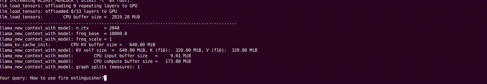
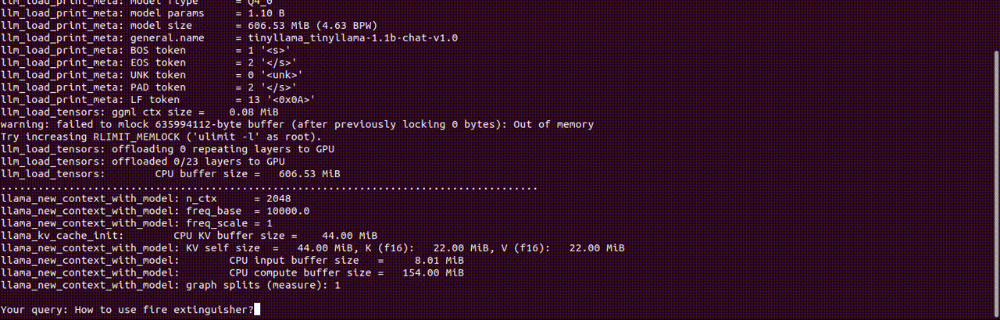
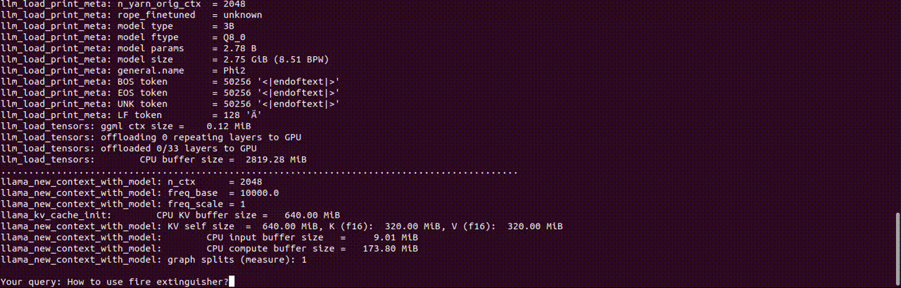

# Small Language Model on the Edge (RAG pipeline)

This project is a native implementation of a RAG pipeline. The main goal was to fit the whole RAG pipeline into a resource constrained device, such as smartphone.
By design the provided RAG library should be deployable on various platforms. There is also a terminal demo application to check how does the pipeline works.

Each of the components creating together a RAG application are independent and technologies beneath can be swapped without braking the pipeline flow.

## Demo

A demo application running RAG pipeline on:

- Samsung S24 Ultra with (LLM: Phi-2 Q8 and gte-large for embeddings)



- Samsung S20 FE with (LLM: TinyLLama 1.1B Q4 and gte-base for embeddings)



- Laptop CPU (LLM: Phi-2 Q8 and gte-large for embeddings)




## Building the project

Build is handled by conan package manager. In order to build Android package first you must install conan. This repository uses conan V2.

Please add this to your conan profiles i.e. `~/.conan2/profiles/android`:

The environment variables explicitly specifying the compiler paths were a:dded to be able to build boost library within the conan environment.

**Important:** If you will need to  change the `os.api_level` please make sure, you also changed the `CC` and `CXX` binary names accordingly. This is due to manual compiler specification.

```conf
include(default)

[settings]
os=Android
os.api_level=23
arch=armv8
compiler=clang
compiler.version=17
compiler.libcxx=c++_shared
compiler.cppstd=20

[conf]
tools.android:ndk_path=<path to Android NDK>

[buildenv]
CHOST=$target_host
CC=<path to Android NDK>/toolchains/llvm/prebuilt/linux-x86_64/bin/aarch64-linux-android23-clang
CXX=<path to Android NDK>/toolchains/llvm/prebuilt/linux-x86_64/bin/aarch64-linux-android23-clang++
```

Not all of the used third party libraries have their own recipes inside conan center. In order to still be compliant with the conan ecosystem this repository contains the `conan` directory with additional recipes used. The packages can be simply installed by executing the `install_packages.bash` script, which will take care of installing the third party packages for the `default`  and `android` conan profiles. You can adapt it for your needs.

To build the project just run `conan build . --profile=<desired profile> --build=missing`. inside the `rag` directory.

## Demo application

Here is the help for the demo application:
```bash
./rag_demo --help
Utility application for creating the embeddings database dump:
  -h [ --help ]                         produce help message
  -m [ --embedding_model ] arg (=./gte-base-f32.gguf)
                                        Model used to generate the embeddings.
  -o [ --database_output ] arg          Path to an output file with calculated 
                                        embeddings.
  --queries_input arg                   Input file containing the queries to 
                                        run against. If provided interactive 
                                        mode will be disabled.
  --database_input arg                  Input file containing the previously 
                                        dumped database.
  -t [ --embedding_threads ] arg (=1)   Number of threads to run the embeddings
                                        model.
  --result_output arg                   Output file to log the retrieved chunks
                                        with the queries
  -b [ --embedding_batch_size ] arg (=512)
                                        Maximum batch size of running the 
                                        embeddings model. Must be set to a 
                                        value greater than n_ctx of the model.
  --top_k arg (=3)                      Maximum value of the returned document 
                                        chunks per query.
  --mode arg (=CHAT)                    Set the application mode. Allowed 
                                        values: {CHAT, RETRIEVAL}.
  --prompt_template_path arg            A path to mustache prompt template
  --model_path arg                      A path to a LLM model in GGUF format.
  --model_config_path arg               A path to a json LLM model 
                                        configuration.
```

### Configuration files

There are a few configuration files, where specified json format is required.

## Model files

The GGUF model files are generated strictly from the [llama.cpp](https://github.com/ggerganov/llama.cpp) main repository. The instructions for the model conversions and quantizations are given there.

### LLM model

For running the LLM model in the library we need a GGUF model file of the model, t
he library uses `llama.cpp`, so any working model can be used.

For running the LLM model there is also a small configuration file needed, this file specifies the inference parameters (it's given with the `--model_config_path` property for the demo binary). Its structure is as follow:

```json
{
    "temp": 0.8,
    "threads": 10,
    "max_tokens": 500
}
```

And fot the prompt template we use the `mustache` template engine, the location is specified by the `--prompt_template_path` option, for instance:

```mustache
<|system|>
Generate short, concise answer to the Question, using provided context.
Context: {{context}}</s>
<|user|>
Question: {{query}}</s>
```

### Offline document chunk calculation

Document chunks must be provided as a simple `.json` file that contains a chunked knowledge base. This may be a product of running the document chunking scripts on any input. For instance you can use **LangChain** framework to generate such chunks.

The input format should be as follow:

```json
{
    "chunks": [
                {
            "metadata": {
                "source": "data/source_path.pdf",
                "chunk_id": 0
            },
            "content": "Lorem ipsum dolor sit amet, consectetur adipiscing elit, sed do eiusmod tempor incididunt ut labore et dolore magna aliqua."
        },
        // and many more chunks
    ]
}
```

The demo application (running on a faster machine than smartphone) may be used to generate the embeddings for further use in the final application to speed up the loading process. Its only necessary to use the same embeddings model.

The demo application can be simply used with the input and output parameters, here is the example:

```bash
rag_demo \
    --embeddings_model ./gte-base-f32.gguf \
    --database_input ./document_chunks.json \
    --database_output ./embedded_document_chunks.json
```

This will produce the json output file (`./embedded_document_chunks.json`) with a structure similar to this:

```json
{
    "chunks": [
        {
            "metadata": {
                "source": "data/source_path.pdf",
                "chunk_id": 0
            },
            "content": "Lorem ipsum dolor sit amet, consectetur adipiscing elit, sed do eiusmod tempor incididunt ut labore et dolore magna aliqua.",
            "embedding": [
                0.058349836617708206,
                0.034839872270822525,
                ...
            ]
        },
        // and many more embedded chunks
    ]
}
```

## Running within an Android application

To run application witin Android terminal copy the executable, as well as all the libraries produced by this build. The binaries will be put into a single place by calling `make install` within the build directory. This will put the created artifacts into directories `bin`, `lib`, `assets` and `include`.
